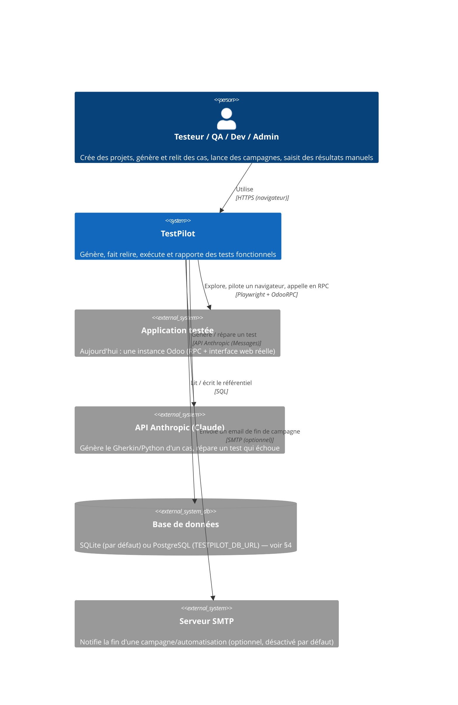
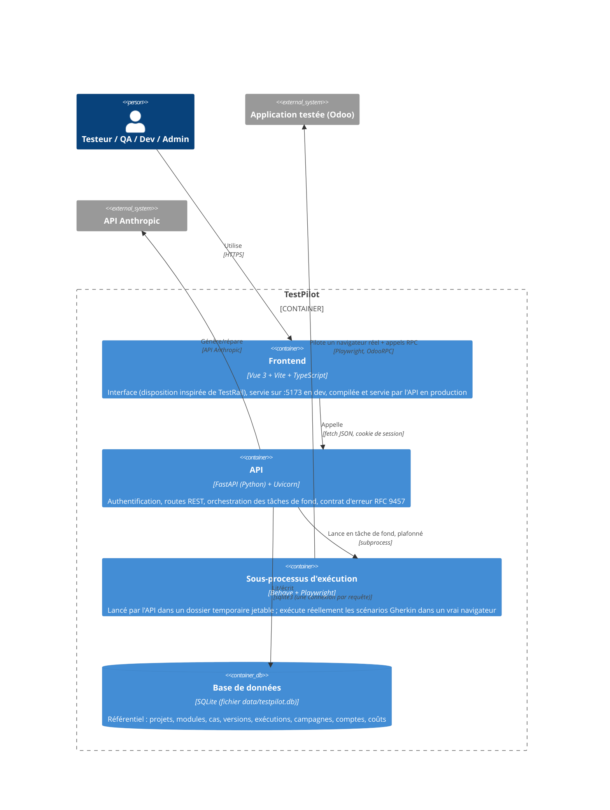
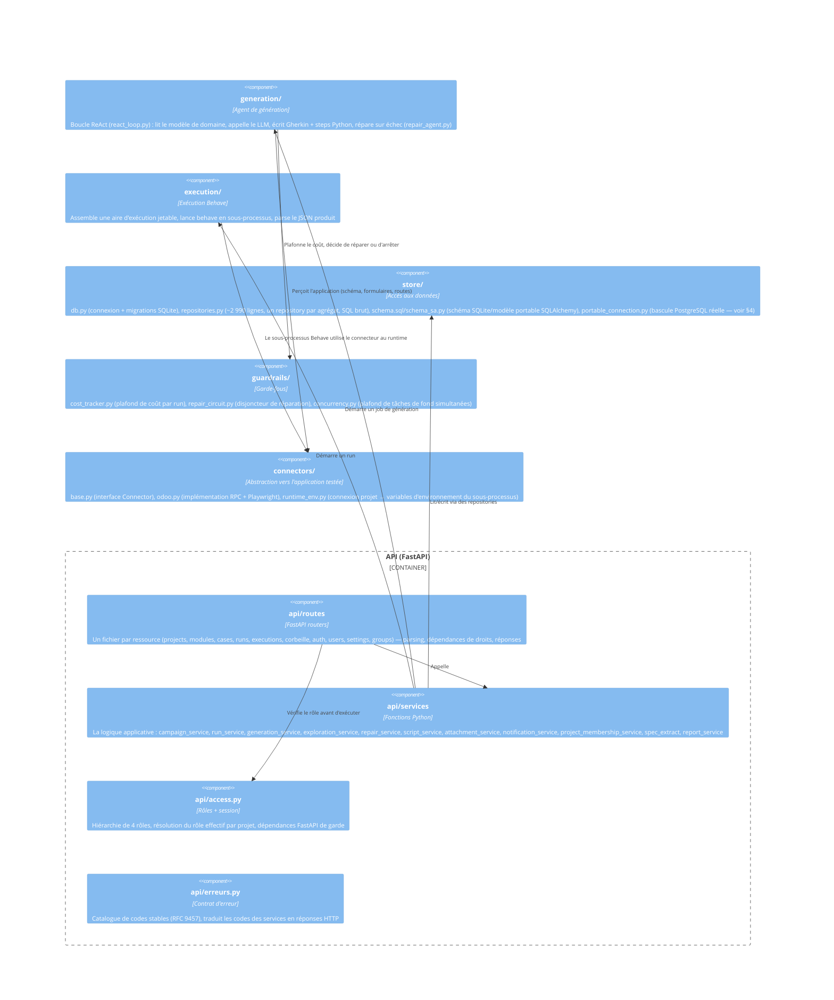

# Architecture de TestPilot

Ce document décrit l'architecture réelle de TestPilot : qui l'utilise, avec quoi il parle, comment
il est découpé en conteneurs puis en composants, et pourquoi certains choix structurants ont été
faits. Il suit une structure inspirée d'arc42 (contexte → conteneurs → composants → décisions) et
utilise le modèle C4 pour les diagrammes.

Pour « comment on installe et on lance », voir `README.md`. Pour « comment consommer l'API »,
voir `docs/API.md`. Ce document ne duplique ni l'un ni l'autre.

## 1. Contexte système (C4 — niveau 1)

TestPilot est un outil de test management piloté par IA : il génère des tests fonctionnels à
partir d'une spécification, fait valider le métier par un humain, exécute réellement ces tests
contre l'application cible, et calcule un verdict.

Ce que ce schéma dit, précisément :

- **Un seul connecteur existe aujourd'hui : Odoo** (`src/testpilot/connectors/odoo.py`). L'interface
  `Connector` (`connectors/base.py`) est déjà une abstraction générale (`connect`, `search`,
  `read`, `inspect_form`, `discover_route`, `create`, `delete`…), mais un seul mapping de connexion
  existe (`connectors/runtime_env.py`, `_MAPPINGS = {"odoo": {...}}`) — l'abstraction attend son
  deuxième connecteur pour être éprouvée.
- **L'API Anthropic** sert à deux usages distincts : générer un test (modèle configuré par
  `TESTPILOT_MODEL_GENERATION`, défaut `claude-sonnet-4-6` — voir `src/testpilot/config.py`) et le
  réparer (`TESTPILOT_MODEL_REPAIR`, défaut `claude-haiku-4-5-20251001`).
- **La base de données** est SQLite par défaut, sans configuration ; PostgreSQL est un runtime
  réel disponible via `TESTPILOT_DB_URL` — voir §4 « SQLite par défaut, PostgreSQL réel en
  option ».

## 2. Conteneurs (C4 — niveau 2)

Quatre conteneurs, pas plus :

- **Frontend** — Vue 3.5 + Vite 6 + TypeScript, état serveur via `@tanstack/vue-query`
  (`frontend/package.json`). En développement il tourne à part (`npm run dev`, port 5173) ; en
  production, `npm run build` produit `frontend/dist/`, monté et servi directement par l'API
  FastAPI (`src/testpilot/api/app.py`, `_FRONTEND_DIST`) — un seul port en production, deux en
  développement (CORS explicitement autorisé pour les origines Vite, voir `_DEV_ORIGINS`).
- **API** — FastAPI (`api/app.py`), lancée par `uvicorn testpilot.api.app:app`. Porte
  l'authentification (middleware `verrou_acces`), les routes, les services applicatifs, et déclenche
  les tâches longues (génération, exécution, exploration) en tâche de fond FastAPI
  (`BackgroundTasks`), admises par une file d'attente à concurrence bornée (§4, `guardrails/`).
- **Sous-processus d'exécution** — un vrai processus `behave` est lancé pour chaque run
  (`execution/behave_runner.py`), dans un dossier temporaire assemblé à la volée (harnais +
  bibliothèque de steps + le `.feature` du module). C'est ce sous-processus, piloté par Playwright,
  qui ouvre réellement un navigateur contre l'application testée. Ce n'est pas un simple appel de
  fonction en mémoire : c'est un processus séparé, avec ses propres timeouts
  (`BEHAVE_DRY_TIMEOUT_SECONDS`, `BEHAVE_REAL_TIMEOUT_SECONDS`).
- **Base de données** — SQLite (`sqlite3`, stdlib), un fichier (`data/testpilot.db` par défaut,
  réglable via `TESTPILOT_DATA_DIR`/`TESTPILOT_DB_PATH`). Une connexion par requête HTTP
  (`api/deps.py::get_conn`), ouverte puis fermée proprement. Le schéma se construit et se met à
  jour tout seul à l'ouverture (`store/db.py`, `init_db` + une chaîne de migrations Python
  idempotentes).

## 3. Composants clés côté backend (C4 — niveau 3, non exhaustif)

Uniquement les composants qui structurent le comportement, pas un inventaire fichier par fichier.

- **`api/routes/` + `api/services/`** — la façade HTTP. Les routes ne portent presque aucune
  logique : elles valident la requête, posent la garde de droits (`access.require_project_access`,
  `access.require_role`…), appellent un service, traduisent ses erreurs
  (`erreurs.depuis_service`). Les services (`api/services/*.py`) portent la logique métier —
  démarrage d'une génération, lancement d'une campagne, etc.
- **`generation/`** — l'agent qui écrit un test. `agent.py` orchestre : assembler le prompt
  (`prompt.py`), consulter le modèle de domaine versionné (`domain_model.py`, voir décision `0021`
  ci-dessous), boucler avec le LLM (`react_loop.py`) jusqu'à un test qui passe le dry-run, dans les
  limites du disjoncteur de réparation (`guardrails/repair_circuit.py`) et du plafond de coût
  (`guardrails/cost_tracker.py`).
- **`execution/`** — exécute réellement. `behave_runner.py` assemble un dossier temporaire
  (harnais + bibliothèque de steps partagée + le `.feature` généré), lance `behave` en
  sous-processus, avec des timeouts distincts pour le dry-run (défaut 120 s) et le run réel (défaut
  900 s) ; `executor.py` orchestre dry-run puis run réel avec un retry sur timeout UI transitoire ;
  `behave_result.py` parse le JSON produit par un formatter Behave maison.
- **`store/`** — l'accès aux données. `db.py` ouvre la connexion SQLite et applique, à chaque
  démarrage, une chaîne de migrations Python idempotentes (38 fonctions `_migrate_N_...`) qui
  construisent le schéma réel. `repositories.py` (2 987 lignes) porte un repository par agrégat
  (`ProjectRepo`, `CaseRepo`, `UserRepo`, `ProjectAccessRepo`…), en SQL brut avec des dicts en
  entrée/sortie — pas d'ORM. Voir §4 pour `schema_sa.py`/`portable_connection.py` (PostgreSQL).
- **`guardrails/`** — trois plafonds indépendants : `cost_tracker.py` (coût USD d'un run de
  génération/réparation, barème par modèle), `repair_circuit.py` (arrête de réparer un test après
  un plafond d'itérations, un « stall » sans progrès, ou quand l'origine du défaut indique un vrai
  bug applicatif plutôt qu'un test cassé), et `concurrency.py` (plafond de tâches de fond
  *actives* simultanément — voir §4).
- **`connectors/`** — l'abstraction vers l'application testée. `base.py` définit l'interface
  `Connector` (cycle de vie, perception : `get_schema`/`search`/`read`/`inspect_form`/
  `discover_route`, écriture : `create`/`delete`). `odoo.py` est la seule implémentation existante,
  à moitié RPC (OdooRPC), à moitié perception d'interface réelle (Playwright, pour voir les champs
  qu'un formulaire affiche vraiment, y compris ceux injectés côté serveur). `runtime_env.py`
  traduit la connexion d'un projet en variables d'environnement pour le sous-processus Behave, et
  refuse explicitement de retomber en silence sur une connexion par défaut si celle du projet est
  incomplète (`ConnexionIncomplete`).

## 4. Décisions d'architecture qui comptent

### Pourquoi le modèle de domaine est un annuaire versionné par projet, pas généré à la volée (décision `0021`)

Le modèle de domaine — ce que l'agent de génération sait des champs, formulaires et routes de
l'application testée — vit dans `data/domain/projet-{id}.json` (`generation/domain_model.py`,
`chemin_du_modele`). Il est produit par un crawl déterministe (`scripts/crawl_domaine.py`, aucun
LLM) et **relu par un humain avant d'être adopté**, comme n'importe quel autre fichier versionné.

Trois raisons, vérifiées dans le code (`domain_model.py`, tête de fichier) :

1. **Un crawl à chaud rendrait le gate de relecture dépendant de la disponibilité d'Odoo** —
   ouvrir l'écran d'un cas déclencherait potentiellement plusieurs minutes de navigation, et une
   application testée indisponible casserait un écran qui n'a pourtant besoin que d'une référence.
2. **Un modèle qui se recalcule tout seul n'est pas une référence.** Si l'application régresse (un
   champ disparaît), un crawl à chaud enregistrerait cette régression comme la nouvelle vérité —
   silencieusement. La détection de régression exige que le modèle reste ce qu'un humain a validé,
   pas ce que l'application dit aujourd'hui.
3. **Le diff Git est la revue.** `git diff data/domain/projet-1.json` montre exactement les champs
   ajoutés ou retirés d'une exploration à l'autre.

Conséquence assumée et documentée dans le code même : le modèle est une *photo*, elle vieillit. Le
smoke-check ne bloque rien si le modèle est absent — un modèle absent n'est pas une erreur — mais
son silence ne vaut jamais validation.

Autre point vérifié dans le code : le modèle est **par projet**, pas par type de connecteur
(`chemin_du_modele` indexe sur `project_id`, avec un repli lecture-seule vers l'ancien emplacement
par connecteur, `chemin_legacy`). Deux projets utilisant tous deux Odoo peuvent pointer vers deux
instances différentes, avec des champs et routes différents — partager un seul modèle par
connecteur aurait fait générer des tests pour l'application du mauvais client.

### Pourquoi la suppression est en deux temps : corbeille puis purge

`api/routes/corbeille.py` expose trois gestes distincts et volontairement asymétriques : lister ce
qui est à la corbeille, restaurer (l'inverse exact de la suppression), et purger (la destruction,
irréversible). Purger n'est possible que sur un élément déjà à la corbeille — purger directement un
élément vivant n'existe pas comme geste : cela forcerait à passer par la case suppression, qui
laisse une trace et une fenêtre de retour arrière.

Techniquement, la suppression douce est portée par une colonne `deleted_at`, vide pour un élément
vivant (`store/repositories.py`, commentaire de tête : `deleted_at = ''` plutôt que `NULL`, pour ne
pas s'oublier dans une condition composée). La visibilité est hiérarchique : un élément n'est
visible que si ni lui ni aucun de ses parents n'est à la corbeille — masquer un module sans masquer
ses cas laisserait des cas orphelins visibles.

Point de sécurité vérifié dans le code (`corbeille.py`, `require_corbeille_access`) : purger un
projet ou n'importe lequel de ses modules/sections/cas est une action **irréversible**, et la route
vérifie l'accès au projet propriétaire de l'élément avant de l'autoriser — un trou fermé
explicitement le 2026-08-11 selon le commentaire du fichier.

### SQLite par défaut, PostgreSQL réel en option — état vérifié au 2026-09-03

`TESTPILOT_DB_URL` vide (le défaut) : l'application tourne sur **SQLite**, comportement inchangé
depuis toujours (`data/testpilot.db`, réglable via `TESTPILOT_DATA_DIR`/`TESTPILOT_DB_PATH`).
`TESTPILOT_DB_URL` renseignée (`postgresql+psycopg://...`) : le runtime bascule **réellement** sur
PostgreSQL — `src/testpilot/api/deps.py::get_conn` et tout code qui appelle
`testpilot.store.db.get_initialized_db()` sans argument explicite passent alors par
`src/testpilot/store/portable_connection.PostgresConnection`, pas par `sqlite3`.

- `store/portable_connection.py` fait tourner les **mêmes repositories** (SQL brut, paramètres
  `?`) sur PostgreSQL sans les réécrire : traduction `?`→`%s`, `INSERT OR IGNORE`→
  `ON CONFLICT DO NOTHING`, ajout de `RETURNING id` pour les tables qui en ont besoin (liste
  `_TABLES_AVEC_ID`, vérifiée exhaustivement contre le schéma par un garde-fou dédié —
  `tests/test_tables_avec_id_postgres.py`, après qu'un oubli réel — la table `scenario_result`,
  remplie à chaque scénario Behave — s'y soit glissé et ait été corrigé). Refuse de servir une
  connexion si le schéma appliqué (`alembic upgrade head`) n'est pas la révision attendue.
- `scripts/migrate_sqlite_to_postgres.py` migre les données réelles vers une base PostgreSQL déjà
  migrée par Alembic et vide : snapshot SQLite cohérent (API `sqlite3.Connection.backup()`, source
  jamais modifiée), copie dans une transaction PostgreSQL unique, vérification par comptage ET
  empreinte SHA-256 avant validation. Procédure détaillée dans `docs/DEPLOIEMENT.md`.
- Deux migrations Alembic rétablissent sous PostgreSQL des invariants que SQLite assurait
  autrement : l'unicité de nom insensible à la casse (`COLLATE NOCASE` → index d'expression
  `lower(...)`) et le trigger qui refuse un résultat dont le mode contredit celui de sa campagne.
- `tests/test_postgres_runtime.py` (7 tests, opt-in via `TESTPILOT_TEST_POSTGRES_URL`) et un job CI
  dédié (`.github/workflows/ci.yml`, service PostgreSQL réel) prouvent ce runtime à chaque
  push/PR — pas seulement lors d'une vérification manuelle ponctuelle.

Reste hors périmètre, délibérément : la bascule de production elle-même (décider quand et sur quel
environnement réel basculer), et un double-run de vérification étendu sur des données de
production réelles avant cette bascule.

*Remarque de méthode, gardée pour mémoire : la première version de cette section, écrite par un
agent dont le worktree avait été créé avant que ce travail ne soit committé sur `master`, décrivait
honnêtement — et à raison, pour ce qu'il pouvait voir — un état où « rien n'est branché sur le
runtime ». Corrigé après coup contre l'état réel de `master`, une fois le décalage de commit
repéré. Un rappel que même une vérification rigoureuse contre le code est datée par la révision
qu'on a sous les yeux.*

## 5. Ce que ce document ne couvre pas

- Le déploiement (serveur, reverse proxy, sauvegarde, bascule PostgreSQL) : `docs/DEPLOIEMENT.md`.
  L'exploitation au quotidien (santé, pannes courantes) : `docs/EXPLOITATION.md`.
- Le détail de chaque route HTTP : voir `docs/API.md` et la documentation générée (`/docs`,
  `/redoc`).
- Le détail du modèle de données (colonnes, contraintes) : la source de vérité est
  `src/testpilot/store/schema.sql` et la chaîne de migrations dans `src/testpilot/store/db.py`.
